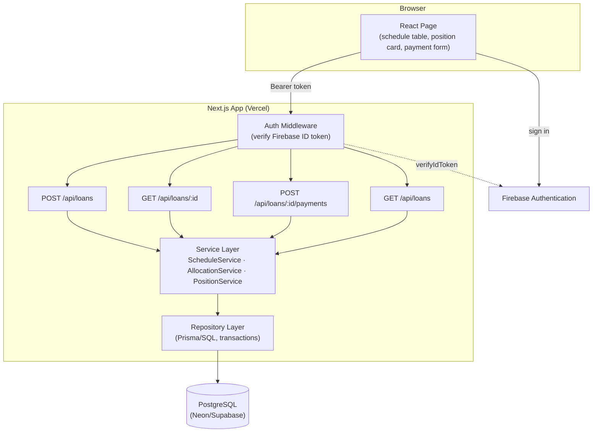
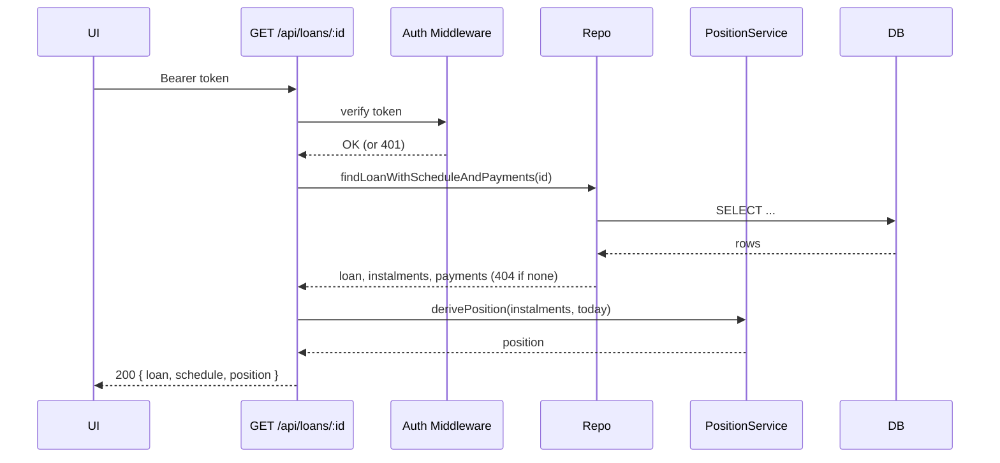
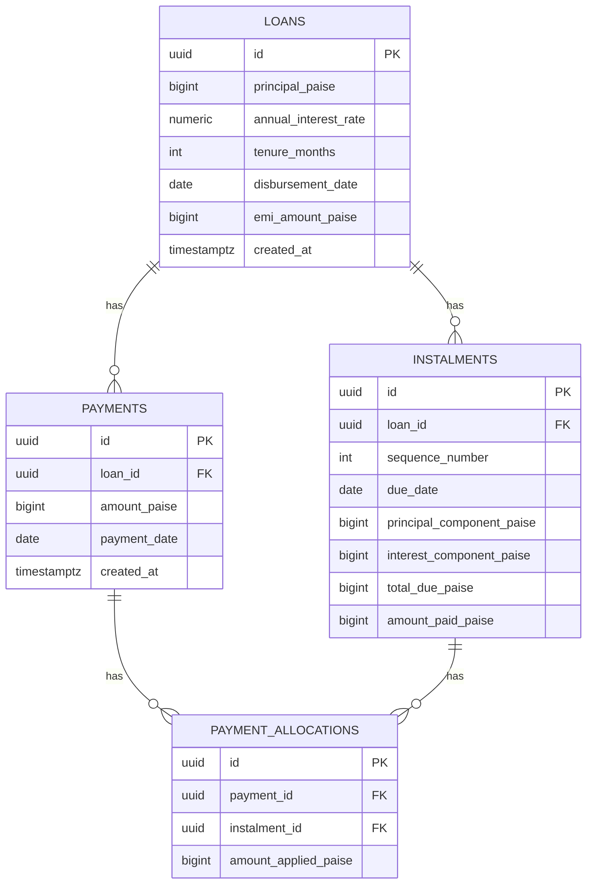
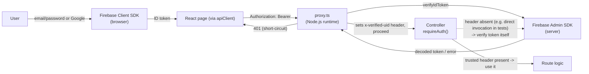
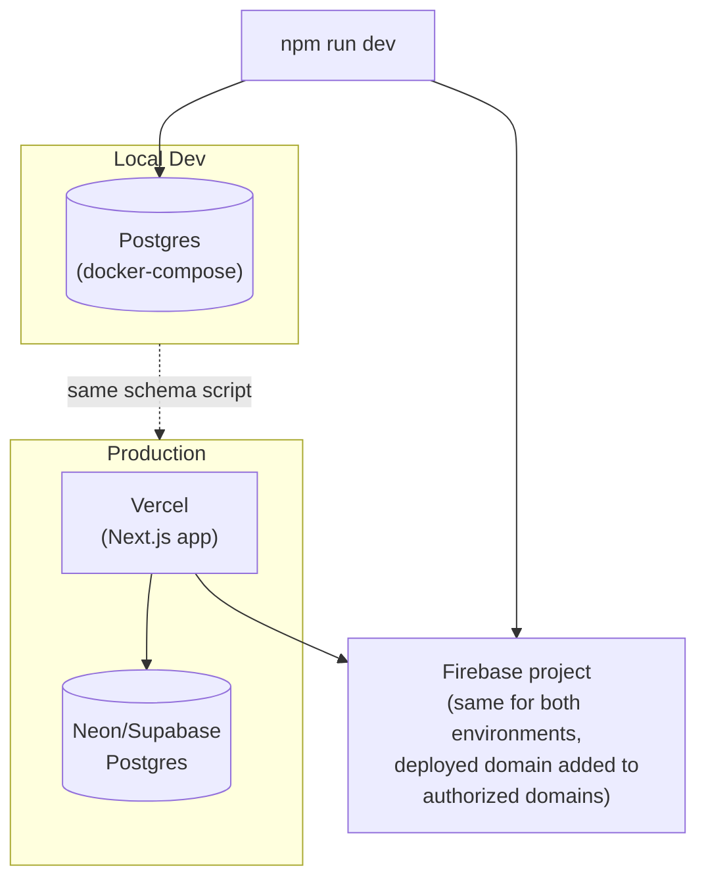

# Architecture Document
## Loan Repayment Service — MSME Lending

| | |
|---|---|
| **Project** | Loan Repayment Service (Vitto Full Stack SDE Assignment) |
| **Author** | Sarthak Shreshtha |
| **Status** | Draft |
| **Version** | 1.0 |
| **Traces to** | PRD.md v1.0, SRS.md v1.0 |

---

## 1. Architectural Style

A single **Next.js monolith** — one deployable app serving both the API (route handlers under `app/api/`) and the one-page UI. No separate backend service; no microservices — the brief's scope (3 endpoints, 1 page, ~5 hours) doesn't justify that overhead, and a single deployable is also simpler to verify on a clean machine (brief §03).

Internally, the API layer is still **layered**, so business logic isn't tangled into route handlers:

```
Route Handler (HTTP in/out, auth check)
        │
Service Layer (schedule generation, allocation, position — pure business logic)
        │
Repository / Data Access Layer (Prisma or SQL, transactions)
        │
PostgreSQL
```

This separation is what makes the "unit tests for schedule generation and allocation" requirement (brief §01) clean to satisfy — those services are plain functions/classes with no HTTP or DB coupling, so they're testable in isolation, and the same logic is exercised end-to-end by the integration tests through the route handlers.

## 2. High-Level Architecture



## 3. Tech Stack

| Layer | Choice | Why |
|---|---|---|
| Framework | Next.js (App Router), TypeScript | Single deployable for UI + API; route handlers double as the REST layer |
| UI | React (no component library) | Brief explicitly says styling/component libraries aren't required |
| Data access | Prisma (recommended) or plain SQL | Prisma gives migrations "for free" (schema-as-code, satisfies "created by a script") and typed queries; plain SQL is equally acceptable per brief — not assessed either way |
| Database | PostgreSQL (Neon or Supabase) | Required by brief; both are pre-approved hosted options and both work identically locally and in production |
| Auth | Firebase Authentication (client SDK) + Firebase Admin SDK (server-side token verification) | Required by brief; Admin SDK is what makes "verified server-side" possible, not just client-side trust |
| Testing | Vitest or Jest (unit) + same runner against a real test DB (integration) | Fast unit tests for pure logic, real-DB integration tests per brief §01 |
| Deployment | Vercel (app) + Neon/Supabase (DB) | Zero-config Next.js hosting; env vars managed outside the repo |

## 4. Component Breakdown

### 4.1 Route Handlers (`app/api/**/route.ts`)
Deliberately trivial — each exported `GET`/`POST` does nothing but extract dynamic params (if any) and delegate to `lib/http.ts`'s `handleRoute()` with the matching controller call. No parsing, validation, auth, or business logic lives here; a route file is the only place that imports `next/server`'s response types indirectly (via `handleRoute`), which is what keeps the controller layer testable without Next.js in the loop.

### 4.2 Auth: Proxy + `requireAuth()`
Two layers, not one:
- **`proxy.ts`** (project root) — a real Next.js Proxy (the file convention Next 16 renamed from `middleware.ts`; it now defaults to the **Node.js runtime**, which is what makes running the Firebase Admin SDK here possible at all). Matches `/api/:path*` and verifies the `Authorization: Bearer <token>` header via `verifyBearerToken()` before a request reaches any route. On success it attaches the verified `uid`/`email` as internal request headers; on failure it returns `401` immediately, before any route/controller code or the database is touched.
- **`requireAuth()`** (`lib/auth/verifyToken.ts`) — called once per controller (see 4.3.1). Trusts Proxy's headers when present (the normal path for real traffic — no second Admin SDK round-trip), otherwise independently verifies the token itself. That fallback isn't redundant: Next's own docs warn against relying on Proxy alone (a routing change could silently skip it), and anything that invokes a route handler directly — our integration tests, for instance — bypasses `proxy.ts` entirely and needs `requireAuth()` to still enforce auth on its own.

Centralizing verification this way — one Proxy file plus one shared guard function, rather than hand-rolled checks per route — is what guarantees every endpoint actually enforces auth, and is the one thing worth double-checking manually before submission.

### 4.3 Controller Layer (`lib/controllers/*.ts`)
Sits between routes and services. Each function corresponds to one endpoint (`createLoan`, `getLoan`, `listLoans`, `recordPayment`) and owns the full use case: call `requireAuth()`, parse/validate the request body, call the service layer for business logic, call the repository for persistence, shape the response. Returns a plain `{ status, body }` (`RouteResult`) rather than a `NextResponse` — controllers don't know Next.js exists, which is what makes them unit-testable in isolation and keeps the dependency direction pointing inward (routes depend on controllers, controllers depend on services/repository — never the reverse).

This is the layer the brief's "examine specific functions and ask how your allocation logic behaves" scrutiny actually lands on for anything HTTP-shaped (duplicate handling, validation ordering, response assembly) — the service layer (4.3.1) is where it lands for the pure money math.

#### 4.3.1 Service Layer (`lib/services/*.ts`)
- **`ScheduleService`** — pure function `generateSchedule(principal, annualRate, tenureMonths, disbursementDate) → Instalment[]`. Implements the EMI formula and rounding rules from SRS §3.1/§7.5. No DB access — takes primitives, returns plain objects. This is what the unit tests target directly.
- **`AllocationService`** — pure function `allocate(instalments, payment) → { updatedInstalments, appliedTo[] }` implementing the oldest-first cascade from SRS §7.1–7.2. Also pure — no DB access — so allocation edge cases (underpayment, overpayment, cascade) are unit-tested without spinning up a database.
- **`PositionService`** — pure function `derivePosition(instalments, today) → { outstandingPrincipal, nextDueDate, nextDueAmount, overdueAmount }` implementing SRS §7.3. Called on every `GET /api/loans/:id` — never stored, always recomputed, so it can never drift out of sync (SRS §4.2).

Keeping these three as pure functions (inputs → outputs, no side effects) is the single biggest architectural decision in this project: it's what makes "explain how your allocation logic behaves in a case not specified in the brief" (brief §04) something you can answer by pointing at a small, isolated function rather than tracing through HTTP handlers and DB calls.

### 4.4 Repository / Data Access Layer
Wraps all DB reads/writes. Two responsibilities beyond plain CRUD:
- **Transaction boundaries** — loan+schedule creation, and payment+allocation updates, each happen inside a single DB transaction, so a failure partway through can't leave the schedule half-written or a payment recorded without its allocation.
- **Duplicate detection** — the unique constraint on `payments(loan_id, amount_paise, payment_date)` (SRS §4.2) is enforced here; the repository catches the constraint violation and returns "this is a replay" rather than letting a raw DB error bubble up.

### 4.5 Frontend
One page, a handful of components, and a single API client. Visual design follows `docs/stitch.md` (Vitto's brand palette/typography extracted from vitto.money, adapted for a data-dense internal tool — restrained accent color usage, neutral surfaces for the schedule/KPI data, brand pink reserved for primary actions and overdue alerts) via CSS custom properties in `app/globals.css` — no component library, per the brief.

- `lib/apiClient.ts`'s `authedFetch()` — every component call goes through this, never `fetch()` or a Firebase token directly. It owns the access token's entire lifecycle: decodes the token's own `exp` claim and caches it, proactively refreshing shortly before expiry rather than waiting for a request to fail. If a request still comes back `401` despite that (clock skew, a revoked session), it force-refreshes and retries exactly once; a `401` that persists after that means the session itself is invalid, so it signs the user out and clears the cache so `AuthGate` sends them back to sign-in. A `403` is surfaced distinctly (no retry/sign-out — there's no permission model yet, but this keeps the client correct if one is added).
- `LoanPicker` — lists loans via `GET /api/loans`, lets the user select one (SRS §3.5).
- `ScheduleTable` — renders the schedule with per-row status pills, plus a real client-derived status filter (All/Overdue/Partially Paid/Pending/Paid, with live counts) — "overdue" is computed the same way as the backend (`today > due date && not fully paid`) purely for display, never the source of truth (that stays `position.overdueAmount`).
- `PositionCard` — outstanding principal, next due, overdue amount, rendered as three KPI cards (visually distinct pink ring/text if overdue `> 0`).
- `PaymentForm` — a pill button that opens a modal (amount + date), calls `POST /api/loans/:id/payments`, updates local state from the response (no reload).
- `AuthGate` — wraps the page; redirects to sign-in if no authenticated Firebase user, shows sign-out otherwise.

## 5. Sequence Diagrams

### 5.1 Create Loan
```mermaid
sequenceDiagram
    participant UI
    participant Route as POST /api/loans
    participant Auth as Auth Middleware
    participant Svc as ScheduleService
    participant Repo as Repository
    participant DB

    UI->>Route: principal, rate, tenure, disbursementDate + Bearer token
    Route->>Auth: verify token
    Auth-->>Route: OK (or 401)
    Route->>Route: validate input (400 on failure)
    Route->>Svc: generateSchedule(...)
    Svc-->>Route: instalments[]
    Route->>Repo: createLoanWithSchedule(loan, instalments)
    Repo->>DB: BEGIN; INSERT loan; INSERT instalments; COMMIT
    DB-->>Repo: ok
    Repo-->>Route: loan + schedule
    Route-->>UI: 201 { loan, schedule }
```

### 5.2 Record Payment (including duplicate & overdue cases)
```mermaid
sequenceDiagram
    participant UI
    participant Route as POST /api/loans/:id/payments
    participant Auth as Auth Middleware
    participant Repo as Repository
    participant Svc as AllocationService
    participant DB

    UI->>Route: amount, date + Bearer token
    Route->>Auth: verify token
    Auth-->>Route: OK (or 401)
    Route->>Route: validate input (400 on failure)
    Route->>Repo: findLoan(id) (404 if missing)
    Route->>Repo: findExistingPayment(loanId, amount, date)
    alt duplicate found
        Repo-->>Route: existing payment + allocations
        Route-->>UI: 200 { duplicate: true, ...existing result }
    else new payment
        Route->>Repo: fetchUnpaidInstalments(loanId)
        Repo-->>Route: instalments[]
        Route->>Svc: allocate(instalments, payment)
        Svc-->>Route: updatedInstalments, appliedTo[]
        Route->>Repo: saveInTransaction(payment, updatedInstalments, allocations)
        Repo->>DB: BEGIN; INSERT payment; UPDATE instalments; INSERT allocations; COMMIT
        DB-->>Repo: ok
        Route->>Svc: derivePosition(updatedInstalments, today)
        Svc-->>Route: position
        Route-->>UI: 201 { payment, appliedTo, position }
    end
```

### 5.3 Authenticated Read (`GET /api/loans/:id`)


## 6. Database Schema (ERD)



Full column-level constraints are specified in SRS §4.2 — this diagram is the visual summary. Note `payments.loan_id` is `NOT NULL` with a foreign key — this is the schema-level enforcement the brief requires ("a payment must not be able to exist without an associated loan"), not just an application-level check.

## 7. Folder Structure

```
loan-repayment-service/
├── proxy.ts                           # Next.js Proxy - verifies auth for /api/:path* up front
├── app/
│   ├── api/
│   │   └── loans/
│   │       ├── route.ts              # POST /api/loans, GET /api/loans (delegates to controllers)
│   │       └── [id]/
│   │           ├── route.ts          # GET /api/loans/:id
│   │           └── payments/
│   │               └── route.ts      # POST /api/loans/:id/payments
│   ├── page.tsx                      # the single UI page
│   ├── apiTypes.ts                   # frontend types mirroring the API response shapes
│   └── components/
│       ├── LoanPicker.tsx
│       ├── ScheduleTable.tsx
│       ├── PositionCard.tsx
│       ├── PaymentForm.tsx        # trigger button + modal
│       ├── SignIn.tsx
│       ├── AuthGate.tsx
│       └── BrandMark.tsx          # shared logo mark (docs/stitch.md)
├── lib/
│   ├── apiClient.ts                  # authedFetch() - the frontend's one API entry point
│   ├── auth/
│   │   └── verifyToken.ts            # Firebase Admin SDK wrapper, verifyBearerToken() + requireAuth()
│   ├── controllers/
│   │   ├── loanController.ts         # createLoan, getLoan, listLoans
│   │   ├── paymentController.ts      # recordPayment
│   │   └── types.ts                  # RouteResult
│   ├── services/
│   │   ├── scheduleService.ts
│   │   ├── allocationService.ts
│   │   └── positionService.ts
│   ├── repository/
│   │   └── loanRepository.ts         # all DB access, transactions
│   ├── firebase/
│   │   └── client.ts                 # lazy Firebase client SDK init
│   ├── http.ts                       # handleRoute() - controller result -> NextResponse
│   ├── validation.ts                 # input validation + parseJsonBody()
│   ├── money.ts                      # rupee↔paise conversion helpers
│   ├── dates.ts                      # todayInIst()
│   └── errors.ts                     # standard error shape/codes (SRS §8)
├── prisma/
│   ├── schema.prisma
│   ├── migrations/
│   └── seed.ts                       # demo loans for local + deployed DB
├── tests/
│   ├── unit/
│   │   ├── scheduleService.test.ts
│   │   ├── allocationService.test.ts
│   │   ├── positionService.test.ts
│   │   └── validation.test.ts
│   └── integration/
│       ├── createLoan.test.ts
│       ├── getLoan.test.ts
│       └── auth.test.ts
├── .env.example
├── README.md
└── package.json
```

## 8. Auth Architecture



Key points:
- The **Admin SDK verification happens on the server** — the browser's possession of a token is never treated as sufficient on its own. This is what satisfies "tokens must be verified server-side, not only in the client" (brief §01).
- It happens **twice, cheaply**: once in `proxy.ts` for every real HTTP request (fast rejection before a route or the database is touched), and once more via `requireAuth()`'s fallback for anything that reaches a controller without having gone through Proxy (Next's own docs warn against trusting Proxy alone). In the normal case `requireAuth()` just reads Proxy's already-verified header instead of calling the Admin SDK a second time.
- `lib/apiClient.ts` proactively refreshes the token before it expires (tracked from the token's own `exp` claim); a `401` that still slips through gets one retry with a forced refresh before signing the user out.

## 9. Error Handling Architecture

A single `errors.ts` module exports typed error constructors (`validationError(msg)`, `notFound(msg)`, `unauthorized()`, `internalError()`) that each know their HTTP status and error code. Every route handler's catch block funnels through one `toResponse(error)` helper that produces the exact shape from SRS §8. This guarantees the "consistent across endpoints" requirement structurally, rather than by convention that could drift.

## 10. Testing Architecture

- **Unit tests** target `ScheduleService` and `AllocationService` directly — no HTTP, no DB, so they run in milliseconds and can exhaustively cover the edge cases in SRS §7 (underpayment, overpayment cascade, duplicate no-op is actually tested at the repository/integration level since it depends on the DB constraint).
- **Integration tests** spin up against a real Postgres test database (a separate schema/DB from dev, created the same way via the migration script) and exercise the actual route handlers — this is what the brief means by "against a real database rather than mocks."
- **Test data isolation:** each integration test creates its own loan and cleans up after itself (or the test DB is reset between runs) so tests don't interfere with each other.
- **Single command:** `npm test` runs both unit and integration suites; a `README` note documents that the test DB must be reachable first (e.g. via the same `docker-compose.yml` used for local dev).

## 11. Deployment Architecture



- **Environment parity:** the exact same migration/seed script is run against the hosted DB as against the local one — no manual production schema edits (SRS §3.7).
- **Secrets:** `DATABASE_URL`, Firebase server credentials, and Firebase client config are set in Vercel's dashboard, never committed; `.env.example` documents the variable names only.
- **Demo data:** the seed script populates 1–2 illustrative loans (clearly fake data) on the hosted DB so the live link is explorable immediately (PRD §14).

## 12. Key Architectural Decisions (ADR summary)

| Decision | Rationale |
|---|---|
| Single Next.js app (no separate backend service) | Matches scope; simplest to verify on a clean machine |
| Money as integer paise everywhere, conversion only at API boundary | Eliminates floating-point rounding bugs by construction, not by discipline |
| Schedule/allocation/position logic as pure functions, separate from routes and DB | Directly testable in isolation; also the clearest thing to walk through in an interview |
| Position derived at read time, never stored | Removes an entire class of "cache went stale" bugs |
| Duplicate detection backed by a DB unique constraint, not just app-side checking | Holds up even under concurrent/racing requests, not just sequential ones |
| Transactions around multi-row writes (schedule creation, payment+allocation) | Prevents partial writes on failure |
| Vercel + Neon/Supabase + same Firebase project across environments | Same connection-string shape and schema-application path locally and in production — no "works on my machine" surprises |
| Controller layer between routes and services, returning plain data (`RouteResult`) instead of `NextResponse` | Routes become one-liners; controllers are unit-testable without Next.js; dependency direction stays inward (routes → controllers → services/repository) |
| Proxy (`proxy.ts`) verifies auth first, `requireAuth()` re-verifies if its header is missing | Fast, centralized rejection for real traffic, without silently trusting a layer that a routing change (or a direct-invocation test) could bypass |
| Frontend API client owns the token lifecycle end-to-end (proactive refresh from the JWT's own `exp`, one reactive retry on 401, sign-out only if that still fails) | Distinguishes "token about to/just expired" (recoverable, invisible to the user) from "session truly invalid" (needs sign-in), instead of one-size-fits-all error handling |
| UI visual design driven by CSS custom properties matching Vitto's brand (docs/stitch.md), not a component library | Satisfies the brief's "no component library required" while still giving a coherent, on-brand look — a handful of tokens plus plain CSS classes |

## 13. Extensibility Notes (not built, but the design accommodates them)

- **User roles / ownership:** `payments`/`loans` tables could gain a nullable `created_by` column without restructuring anything else.
- **Multiple currencies:** would require a `currency` column on `loans` and `payments`, plus making the paise-conversion helper currency-aware (paise assumes INR's 2-decimal minor unit).
- **Prepayment/foreclosure:** the `AllocationService` interface (`allocate(instalments, payment)`) could accept a `type: 'REGULAR' | 'PREPAYMENT'` flag and branch to a principal-reduction algorithm instead of the cascade — the pure-function boundary makes this a contained change.
- **Penalty interest:** would add a computed field to `PositionService` (e.g., `penaltyAccrued`) without touching schedule generation or the payment-allocation algorithm.

These are documented for the README/interview, per PRD §14 — none should actually be built, per the brief's explicit exclusions.
